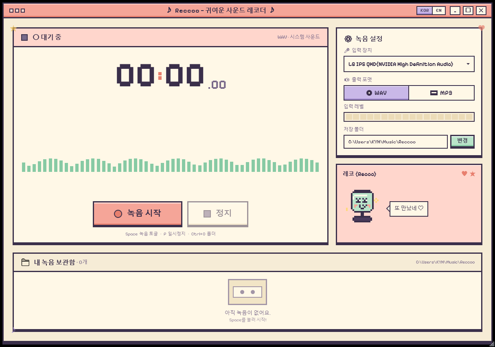

# Reccoo

> 🎀 **A cute pixel-art sound recorder for Windows**
> Built on .NET 9 + WPF

[한국어](README.md) | **English**

Reccoo is a small recorder that captures whatever your PC is playing. Streaming music, game audio, live broadcasts — anything coming out of your speakers can be recorded with a single click and saved as WAV or MP3. Since it records the audio signal directly (not through a microphone), recordings are clean with no background noise. And while you record, the pixel mascot "Recco" keeps you company. 🐤

> **Note**: The app's UI is currently **Korean-only**. English localization is on the wish list — contributions are very welcome (see [Contributing](#-contributing)).




[](https://github.com/darkdarkcocoa/Reccoo/releases/latest)

---

## ⬇️ Download

Download, double-click, done. No installer, no separate .NET runtime required.

> **[📦 Get Reccoo.exe (Windows x64, ~76 MB)](https://github.com/darkdarkcocoa/Reccoo/releases/latest/download/Reccoo.exe)** — this link always points to the **latest release**
> ([](https://github.com/darkdarkcocoa/Reccoo/releases/latest) [](https://github.com/darkdarkcocoa/Reccoo/releases/latest))
>
> It is a self-contained single-file executable with the .NET runtime bundled in. On first launch, SmartScreen may warn about an "unrecognized app" — this is because the binary is not code-signed yet. Click **"More info" → "Run anyway"** to start it.

Full changelogs are on the [Releases page](https://github.com/darkdarkcocoa/Reccoo/releases).

---

## ✨ Features

**🎙️ Recording**

- **System audio capture** — records whatever comes out of your speakers, losslessly (WASAPI loopback)
- **3-second countdown** — the app counts down before recording starts, so you can nail the timing
- **Pause / resume** — skip ads or unwanted sections and pick up where you left off
- **WAV / MP3 toggle** — keep the original as WAV, or save space with MP3 (LO / MED / HI quality)

**👀 Fun to watch**

- **Live waveform** — the current audio dances across 56 pixel bars (mint → gold → coral gradient)
- **Input level meter** — an 18-cell pixel meter shows the volume at a glance
- **Mascot "Recco"** — bobs along with the audio, changes expressions with the recording state, and occasionally chats
- **Dark theme** — switch between light and dark with a toggle in the title bar

**📼 After recording**

- **Library** — recordings are organized as cassette-tape cards, with duration display and inline renaming
- **Mini player** — play recordings right inside the app and seek with a progress bar
- **Drag to export** — drag a card into a folder or a chat window to copy the file
- **Recycle-bin deletes** — deleted files go to the Recycle Bin, so mistakes are recoverable
- **Keyboard shortcuts** — start and stop recording without touching the mouse

---

## 🛠️ Building from source

All you need is the [.NET 9 SDK](https://dotnet.microsoft.com/download) and Windows 10/11.

```powershell
git clone https://github.com/darkdarkcocoa/Reccoo.git
cd Reccoo
dotnet run
```

Or a release build:

```powershell
dotnet build -c Release
./bin/Release/net9.0-windows/Reccoo.exe
```

Audio is captured from the default output device, and files are saved to `Documents\Music\Reccoo\` as `Reccoo_yyyyMMdd_HHmmss.{wav|mp3}`.

---

## 📁 Project structure

The structure is intentionally simple — just a handful of source files, no frameworks.

```
Reccoo/
├── App.xaml                  # Pixel theme ResourceDictionary (palette + control styles)
├── App.xaml.cs
├── MainWindow.xaml           # 1216×736 main layout
├── MainWindow.xaml.cs        # Transport / waveform / library logic
├── Mascot.cs                 # Recco sprite — drawn pixel by pixel, not an image asset
├── AudioRecorder.cs          # NAudio capture + WAV/MP3 encoding
├── AssemblyInfo.cs
├── Reccoo.csproj
├── Fonts/
│   ├── PixelifySans.ttf      # OFL 1.1
│   ├── DotGothic16-Regular.ttf  # OFL 1.1 (Korean pixel font)
│   └── *-OFL.txt             # Font licenses
└── design/                   # Claude Design mockups (gitignored)
```

---

## 🎵 Embedded fonts

| Font | Role | License |
|------|------|---------|
| [Pixelify Sans](https://fonts.google.com/specimen/Pixelify+Sans) | Latin / numerals | OFL 1.1 |
| [DotGothic16](https://fonts.google.com/specimen/DotGothic16) | Korean / CJK | OFL 1.1 |

Thanks to WPF's glyph fallback, text automatically resolves through `Pixelify Sans → DotGothic16 → Consolas`, so Korean renders in pixel style with no extra code.

---

## 🎨 Design tokens

Recco's palette. When touching the UI, please pick from these colors instead of inventing new ones.

```
ink-dark   #3A2F4A      cream      #F6ECD6
ink        #4A3C5C      cream-deep #ECDCB8
ink-soft   #7A6A8A      paper      #FFF8E7
                        coral      #F5A598
mint       #B9E4C9      coral-deep #E87F6E
mint-deep  #87CAA4      lilac      #C9B8E8
gold       #FFD97A      lilac-deep #A48DD0
```

---

## 🤝 Contributing

Bug reports, ideas, and pull requests are all welcome! Please read [CONTRIBUTING.md](CONTRIBUTING.md) first — it explains the conventions this project follows.

---

## 📜 License

[MIT](LICENSE) © darkcocoa — use it freely, just keep the copyright notice.

Fonts are licensed under the [SIL Open Font License 1.1](Fonts/PixelifySans-OFL.txt).

---

<sub>🤖 Designed and built with [Claude Code](https://claude.com/claude-code)</sub>
