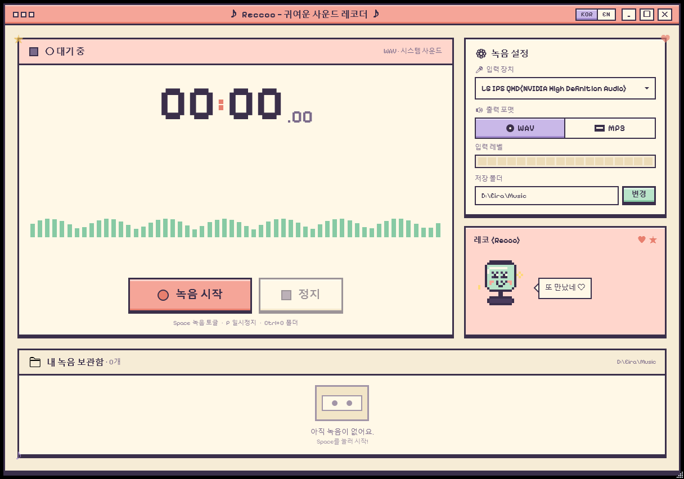
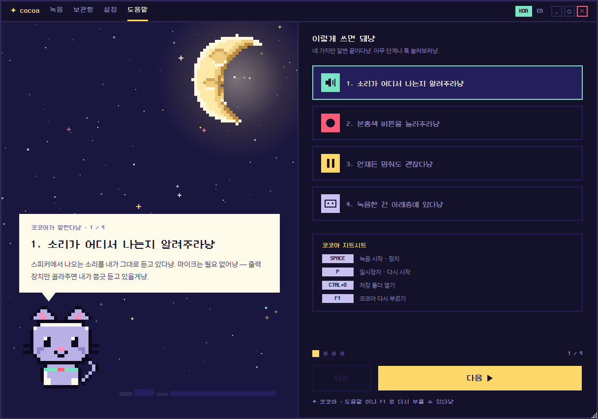

# 코코아 레코더 · Cocoa Recorder

> 🎀 **포근한 픽셀 아트 시스템 사운드 레코더 for Windows**
> A cozy pixel-art system audio recorder built on .NET 9 + WPF

**한국어** | [English](README.md)

코코아 레코더(이전 이름 Reccoo)는 PC에서 재생 중인 소리를 그대로 녹음해 주는 작은 레코더입니다.
스트리밍 음악, 게임 사운드, 라이브 방송 등 스피커로 출력되는 소리라면 무엇이든 버튼 하나로 녹음해 WAV 또는 MP3로 저장할 수 있습니다.
마이크를 거치지 않고 오디오 신호를 직접 캡처하기 때문에 주변 잡음 없이 깨끗한 녹음이 가능합니다.
녹음하는 동안에는 초승달 위에 앉은 픽셀 고양이 "코코아"가 곁에서 말을 걸어 줍니다. 🌙



<sub>코코아가 네 단계로 직접 설명해 줍니다 — 언제든 F1.</sub>




[](https://github.com/darkdarkcocoa/cocoa-recorder/releases/latest)

---

## 🌏 지원 언어

| 구분 | 한국어 | English |
|------|:------:|:-------:|
| **앱 UI** | ✅ | ✅ |
| **마스코트 대사** | ✅ | ✅ |
| **README** | ✅ | ✅ |

앱은 영어로 시작합니다. 타이틀바의 **KOR | EN 토글**로 언제든 전환할 수 있고, 고른 언어는 다음 실행에도 유지됩니다.
다른 언어 추가에 관심이 있다면 [CONTRIBUTING.md](CONTRIBUTING.md)를 참고해 주세요.

---

## ⬇️ 다운로드
내려받아 더블클릭하면 바로 실행됩니다. 별도의 설치 과정이나 .NET 런타임 설치가 필요하지 않습니다.

> 앱은 켤 때 한 번 GitHub에 새 버전이 있는지 물어보고, 있으면 **업데이트** 링크에 **NEW** 표시를 띄웁니다. 사용자에 대한 정보는 아무것도 보내지 않고, 스스로 무언가를 받아오지도 않습니다. `%LOCALAPPDATA%\CocoaRecorder\settings.json`에서 `"CheckForUpdates": false`로 끌 수 있습니다 (카운트다운 냥 소리도 같은 파일의 `"CountdownSound"`에 저장됩니다).
>
> **[📦 최신 Windows 릴리스 다운로드](https://github.com/darkdarkcocoa/cocoa-recorder/releases/latest)** — `CocoaRecorder.exe`를 받으세요. 이름 변경 전 릴리스의 파일명은 `Reccoo.exe`입니다.
> ([](https://github.com/darkdarkcocoa/cocoa-recorder/releases/latest) · 릴리스 시점: [](https://github.com/darkdarkcocoa/cocoa-recorder/releases/latest))
>
> .NET 런타임이 포함된 단일 실행 파일입니다. 처음 실행할 때 SmartScreen이 "알 수 없는 앱" 경고를 표시할 수 있는데, 아직 코드 서명 인증서를 적용하지 않았기 때문입니다. **"추가 정보" → "실행"**을 누르면 정상적으로 사용할 수 있습니다.

버전별 변경 내역은 [Releases 페이지](https://github.com/darkdarkcocoa/cocoa-recorder/releases)에서 확인할 수 있습니다.

---

## ✨ 주요 기능
**🎙️ 녹음**

- **시스템 사운드 캡처** — 스피커로 출력되는 소리를 손실 없이 그대로 녹음합니다. (WASAPI loopback)
- **미니 모드** — 타이틀바의 고양이 얼굴 버튼을 누르면 앱 전체가 화면 위에 떠 있는 작은 카드로 줄어듭니다. 카드는 아무 데나 끌어다 둘 수 있고, 거기서 녹음 시작·정지와 카운트다운 조절이 바로 됩니다. 카드에 표시된 전역 단축키(비어 있으면 `F3`)로는 다른 창에서 작업하다가도 녹음을 시작하고 멈출 수 있어요. 녹음 중에는 코코아가 헤드폰을 끼고 고개를 까딱이고, 주변에 픽셀 음표가 떠오릅니다.
- **카운트다운 조절** — 녹음이 시작되기까지 기다릴 시간을 0~10초 사이에서 고를 수 있습니다. 0으로 두면 누르는 즉시 녹음하고, 길게 두면 다른 창으로 넘어가 재생을 누를 여유가 생깁니다. 숫자마다 코코아가 냥 하고 세어 줘서 다른 창에 가 있어도 귀로 알 수 있고, 옆의 고양이 얼굴 버튼으로 끌 수 있습니다. 0이 되는 순간에는 울지 않으니 녹음 첫머리는 언제나 깨끗합니다.
- **일시정지 / 재개** — 원치 않는 구간은 잠시 멈췄다가 이어서 녹음할 수 있습니다.
- **WAV / MP3 선택** — 원본 그대로 보관하고 싶다면 WAV, 용량을 아끼고 싶다면 MP3를 선택할 수 있습니다. (LO / MED / HI 품질)

**👀 보는 즐거움**

- **숨 쉬는 밤하늘** — 별 141개가 저마다 다른 박자로 반짝이고, 그 옆에 한 칸씩 그려 낸 픽셀 달이 떠 있습니다. 녹음 상태에 따라 하늘색이 함께 바뀝니다.
- **라이브 파형** — 재생 중인 소리가 56개의 픽셀 바로 실시간 표시되고, 멈추면 조용한 선으로 가라앉습니다.
- **입력 레벨 미터** — 18칸 픽셀 미터로 소리의 크기를 한눈에 확인할 수 있습니다.
- **고양이 "코코아"** — 달 위에 앉아 있다가, 녹음 중에는 귀를 쫑긋 세우고 살랑이며, 일시정지하면 몸을 말고 잠듭니다. 가끔 말도 걸어 옵니다.
- **KOR | EN 언어 토글** — 타이틀 바에서 한국어/영어 UI를 즉시 전환할 수 있습니다. 마스코트 대사까지 함께 바뀝니다.

**📼 녹음 후**

- **탭 네 개** — 녹음 · 보관함 · 설정, 그리고 코코아가 직접 네 단계로 설명해 주는 도움말(`F1`)입니다.
- **보관함** — 녹음본마다 색 띠가 붙은 한 줄로 정리됩니다. 줄을 누르면 재생 · 폴더 열기 · 삭제 버튼이 오른쪽에서 흘러나옵니다.
- **미니 플레이어** — 앱 안에서 바로 재생할 수 있고, 줄 아래에 진행 선이 표시됩니다.
- **드래그로 내보내기** — 카드를 끌어 폴더나 메신저 창에 놓으면 파일이 복사됩니다.
- **휴지통 삭제** — 삭제한 파일은 휴지통으로 이동하므로, 실수하더라도 복구할 수 있습니다.
- **키보드 단축키** — `Space` 시작·정지, `P` 일시정지, `Ctrl+O` 저장 폴더, `F1` 도움말.

---

## 💡 이걸로 뭘 녹음하나요?

코코아 레코더는 **PC에서 재생되는 모든 소리**를 캡처하므로, 이런 상황에 쓰기 좋은 무료 도구입니다.

- 🎧 **스트리밍 음악 녹음** — Spotify, YouTube Music, Apple Music, SoundCloud, 벅스/멜론 등
- 📺 **영상 소리 저장** — 유튜브, 트위치, 넷플릭스 등 브라우저 재생 오디오
- 🎙️ **화상 회의·통화 녹음** — Discord, Zoom, Microsoft Teams, Google Meet
- 🎮 **게임 사운드·보이스 대사 캡처**
- 📻 **라이브 라디오·팟캐스트·방송 아카이빙**
- 🎓 **강의·웨비나·어학 학습 오디오 보관**

마이크를 거치지 않고 **WASAPI loopback**으로 오디오 신호를 직접 캡처하기 때문에, 주변 잡음 없이 깨끗하게 녹음됩니다.

> ⚠️ 저작권과 각 서비스의 이용약관을 지켜 주세요 — 저장할 권리가 있는 콘텐츠만 녹음하시기 바랍니다.

---

## 🛠️ 소스에서 빌드하기
[.NET 9 SDK](https://dotnet.microsoft.com/download)와 Windows 10/11만 있으면 됩니다.

```powershell
git clone https://github.com/darkdarkcocoa/cocoa-recorder.git
cd cocoa-recorder
dotnet run
```

릴리스 빌드는 다음과 같이 실행합니다.

```powershell
dotnet build -c Release
./bin/Release/net9.0-windows/CocoaRecorder.exe
```

녹음은 기본 출력 장치에서 캡처됩니다. 새 설치는 `Music\Cocoa Recorder\` 폴더에 `CocoaRecorder_yyyyMMdd_HHmmss.{wav|mp3}` 형식으로 저장하고, 기존 `Music\Reccoo\` 보관함은 이동하지 않고 그대로 이어서 엽니다.

---

## 📁 프로젝트 구조
구조는 의도적으로 단순하게 유지하고 있습니다. 프레임워크 없이 소스 파일 몇 개가 전부입니다.

```
cocoa-recorder/
├── App.xaml                  # 픽셀 테마 ResourceDictionary (팔레트 + 컨트롤 스타일)
├── App.xaml.cs
├── MainWindow.xaml           # 1216×852 메인 레이아웃
├── MainWindow.xaml.cs        # 트랜스포트 / 파형 / 보관함 로직
├── OverlayWindow.xaml        # 미니 모드 — 화면 위에 떠 있는 작은 카드
├── OverlayWindow.xaml.cs     # 전역 단축키 + 본창 상태 미러
├── Mascot.cs                 # 고양이 코코아, 22×24칸 — 이미지가 아니라 한 칸씩 직접 그림
├── NightSky.cs               # 픽셀 달과 반짝이는 별밭
├── Localization.cs           # 한국어 / 영어 문구
├── AudioRecorder.cs          # NAudio 캡처 + WAV/MP3 인코딩
├── CountdownChime.cs         # 카운트다운 냥 소리 재생
├── AssemblyInfo.cs
├── CocoaRecorder.csproj
├── Fonts/
│   ├── PixelifySans.ttf      # OFL 1.1
│   ├── neodgm.ttf            # OFL 1.1 (디스플레이 글꼴)
│   ├── SUIT-*.ttf            # OFL 1.1 (가독성 UI 글꼴)
│   └── *-OFL.txt             # 폰트 라이선스
├── Sounds/
│   └── meow-1..5.mp3         # 카운트다운 냥 소리 (CC0)
├── Art/
│   ├── overlay-frame.png     # 미니 모드 고양이 귀 픽셀 프레임
│   └── cocoa-*.png           # 미니 모드 포즈 스프라이트
└── design/                   # Claude Design 시안 (gitignored)
```

---

## 🎵 임베드 폰트
| 폰트 | 용도 | 라이선스 |
|------|------|----------|
| [Pixelify Sans](https://fonts.google.com/specimen/Pixelify+Sans) | 대형 타이머 숫자 | OFL 1.1 |
| [네오둥근모](https://github.com/neodgm/neodgm) | 픽셀 제목과 주요 조작부 | OFL 1.1 |
| [SUIT](https://github.com/sun-typeface/SUIT) | 설명, 경로, 장치명과 보관함 정보 | OFL 1.1 |

중요한 조작부에는 픽셀 감성을 유지하고, 정보량이 많은 한글·영문 UI에는 읽기 쉬운 글꼴을 적용했습니다.

## 🔊 임베드 사운드

| 사운드 | 용도 | 라이선스 |
|--------|------|----------|
| meow-1…5.mp3 | 카운트다운 소리 | CC0 |

---

## 🎨 디자인 토큰

**Moon Studio** 팔레트입니다. 깊은 남색 밤하늘 위에 신호색은 딱 세 가지 — 민트는 활성, 앰버는 대기, 핑크는 녹음입니다. UI를 수정할 때는 새 색상을 만들지 말고 이 안에서 골라 주세요.

```
night      #14122B      cream      #FFFBEA
hero       #191640      lilac      #C9C2F0
panel-sel  #241E5C      mute       #8E86C9
line       #2E2856      ink        #0C0A1C
line-soft  #3A3470
well       #241F45      mint       #7BE3C4   active
                        amber      #FFD86B   waiting
moon-lit   #FFE9A8      pink       #FF5C7A   recording
cat-fur    #B9B1E6      pink-soft  #FF8FB8
```
---

## 🤝 기여하기
기여와 Pull Request는 언제든지 환영합니다! 버그 수정, 기능 개선, 새로운 아이디어를 자유롭게 Issue나 Pull Request로 제안해 주세요. 큰 변경은 먼저 Issue에서 방향을 함께 논의해 주시면 좋습니다. 자세한 원칙은 [CONTRIBUTING.md](CONTRIBUTING.md)를 확인해 주세요.

**앱 안에서도 바로 건의할 수 있습니다.** 설정 레일 맨 아래의 편지 아이콘을 누르면 새 이슈 작성 화면이 열립니다.

---

## 📜 라이선스
[MIT](LICENSE) © darkcocoa — 저작권 표시만 유지하면 자유롭게 사용할 수 있습니다.

폰트는 각각 [SIL Open Font License 1.1](Fonts/PixelifySans-OFL.txt)을 따릅니다.

---

<sub>🤖 시안 디자인 + WPF 구현은 [Claude Code](https://claude.com/claude-code)와 함께 만들었습니다</sub>
