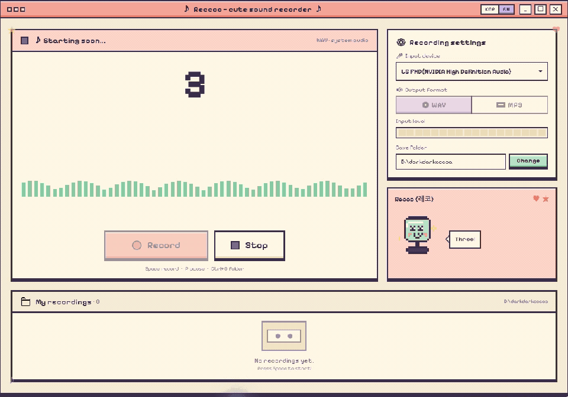

# Reccoo

> 🎀 **귀여운 픽셀 아트 사운드 레코더 for Windows**
> A cute pixel-art audio recorder built on .NET 9 + WPF

**한국어** | [English](README.md)

레코는 PC에서 재생 중인 소리를 그대로 녹음해 주는 작은 레코더입니다.
스트리밍 음악, 게임 사운드, 라이브 방송 등 스피커로 출력되는 소리라면 무엇이든 버튼 하나로 녹음해 WAV 또는 MP3로 저장할 수 있습니다.
마이크를 거치지 않고 오디오 신호를 직접 캡처하기 때문에 주변 잡음 없이 깨끗한 녹음이 가능합니다.
녹음하는 동안에는 픽셀 마스코트 "레코"가 곁에서 말을 걸어 줍니다. 🐤




[](https://github.com/darkdarkcocoa/Reccoo/releases/latest)

---

## 🌏 지원 언어

| 구분 | 한국어 | English |
|------|:------:|:-------:|
| **앱 UI** | ✅ | ✅ |
| **마스코트 대사** | ✅ | ✅ |
| **README** | ✅ | ✅ |

타이틀바의 **KOR | EN 토글**로 언제든 전환할 수 있고, 첫 실행 시 시스템 언어를 자동으로 감지합니다.
다른 언어 추가에 관심이 있다면 [CONTRIBUTING.md](CONTRIBUTING.md)를 참고해 주세요.

---

## ⬇️ 다운로드
내려받아 더블클릭하면 바로 실행됩니다. 별도의 설치 과정이나 .NET 런타임 설치가 필요하지 않습니다.

> **[📦 Reccoo.exe 다운로드 (Windows x64, ~76 MB)](https://github.com/darkdarkcocoa/Reccoo/releases/latest/download/Reccoo.exe)** — 항상 **최신 릴리스**를 받는 링크입니다
> ([](https://github.com/darkdarkcocoa/Reccoo/releases/latest) · 릴리스 시점: [](https://github.com/darkdarkcocoa/Reccoo/releases/latest))
>
> .NET 런타임이 포함된 단일 실행 파일입니다. 처음 실행할 때 SmartScreen이 "알 수 없는 앱" 경고를 표시할 수 있는데, 아직 코드 서명 인증서를 적용하지 않았기 때문입니다. **"추가 정보" → "실행"**을 누르면 정상적으로 사용할 수 있습니다.

버전별 변경 내역은 [Releases 페이지](https://github.com/darkdarkcocoa/Reccoo/releases)에서 확인할 수 있습니다.

---

## ✨ 주요 기능
**🎙️ 녹음**

- **시스템 사운드 캡처** — 스피커로 출력되는 소리를 손실 없이 그대로 녹음합니다. (WASAPI loopback)
- **3초 카운트다운** — 시작 버튼을 누르면 3초를 세어 준 뒤 녹음이 시작되어, 원하는 타이밍에 맞추기 좋습니다.
- **일시정지 / 재개** — 원치 않는 구간은 잠시 멈췄다가 이어서 녹음할 수 있습니다.
- **WAV / MP3 선택** — 원본 그대로 보관하고 싶다면 WAV, 용량을 아끼고 싶다면 MP3를 선택할 수 있습니다. (LO / MED / HI 품질)

**👀 보는 즐거움**

- **라이브 파형** — 재생 중인 소리가 56개의 픽셀 바로 실시간 표시됩니다. (mint → gold → coral 그라데이션)
- **입력 레벨 미터** — 18칸 픽셀 미터로 소리의 크기를 한눈에 확인할 수 있습니다.
- **마스코트 "레코"** — 소리에 맞춰 움직이고, 녹음 상태에 따라 표정이 바뀌며, 가끔 말을 걸어 옵니다.
- **KOR | EN 언어 토글** — 타이틀 바에서 한국어/영어 UI를 즉시 전환할 수 있습니다. 마스코트 대사까지 함께 바뀝니다.

**📼 녹음 후**

- **보관함** — 녹음본이 카세트 테이프 모양의 카드로 정리됩니다. 재생 길이가 표시되며, 카드에서 바로 이름을 변경할 수 있습니다.
- **미니 플레이어** — 앱 안에서 바로 재생할 수 있고, 진행 바를 드래그해 원하는 위치로 이동할 수 있습니다.
- **드래그로 내보내기** — 카드를 끌어 폴더나 메신저 창에 놓으면 파일이 복사됩니다.
- **휴지통 삭제** — 삭제한 파일은 휴지통으로 이동하므로, 실수하더라도 복구할 수 있습니다.
- **키보드 단축키** — `Space`로 녹음을 시작·정지하고, 마우스 없이도 조작할 수 있습니다.

---

## 💡 이걸로 뭘 녹음하나요?

레코는 **PC에서 재생되는 모든 소리**를 캡처하므로, 이런 상황에 쓰기 좋은 무료 도구입니다.

- 🎧 **스트리밍 음악 녹음** — Spotify, YouTube Music, Apple Music, SoundCloud, 벅스/멜론 등
- 📺 **영상 소리 저장** — 유튜브, 트위치, 넷플릭스 등 브라우저 재생 오디오
- 🎙️ **화상 회의·통화 녹음** — Discord, Zoom, Microsoft Teams, Google Meet
- 🎮 **게임 사운드·보이스 대사 캡처**
- 📻 **라이브 라디오·팟캐스트·방송 아카이빙**
- 🎓 **강의·웨비나·어학 학습 오디오 보관**

마이크를 거치지 않고 **WASAPI loopback**으로 오디오 신호를 직접 캡처하기 때문에, 주변 잡음 없이 깨끗하게 녹음됩니다.

> ⚠️ 저작권과 각 서비스의 이용약관을 지켜 주세요 — 저장할 권리가 있는 콘텐츠만 녹음하시기 바랍니다.

---

## 🛠️ 소스에서 빌드하기
[.NET 9 SDK](https://dotnet.microsoft.com/download)와 Windows 10/11만 있으면 됩니다.

```powershell
git clone https://github.com/darkdarkcocoa/Reccoo.git
cd Reccoo
dotnet run
```

릴리스 빌드는 다음과 같이 실행합니다.

```powershell
dotnet build -c Release
./bin/Release/net9.0-windows/Reccoo.exe
```

녹음은 기본 출력 장치에서 캡처되며, 파일은 `Documents\Music\Reccoo\` 폴더에 `Reccoo_yyyyMMdd_HHmmss.{wav|mp3}` 형식으로 저장됩니다.

---

## 📁 프로젝트 구조
구조는 의도적으로 단순하게 유지하고 있습니다. 프레임워크 없이 소스 파일 몇 개가 전부입니다.

```
Reccoo/
├── App.xaml                  # 픽셀 테마 ResourceDictionary (팔레트 + 컨트롤 스타일)
├── App.xaml.cs
├── MainWindow.xaml           # 1216×736 메인 레이아웃
├── MainWindow.xaml.cs        # 트랜스포트 / 파형 / 보관함 로직
├── Mascot.cs                 # 레코 스프라이트 — 이미지가 아닌 픽셀 단위 드로잉
├── AudioRecorder.cs          # NAudio 캡처 + WAV/MP3 인코딩
├── AssemblyInfo.cs
├── Reccoo.csproj
├── Fonts/
│   ├── PixelifySans.ttf      # OFL 1.1
│   ├── DotGothic16-Regular.ttf  # OFL 1.1 (한글 픽셀)
│   └── *-OFL.txt             # 폰트 라이선스
└── design/                   # Claude Design 시안 (gitignored)
```

---

## 🎵 임베드 폰트
| 폰트 | 용도 | 라이선스 |
|------|------|----------|
| [Pixelify Sans](https://fonts.google.com/specimen/Pixelify+Sans) | 라틴 문자 픽셀 글꼴 | OFL 1.1 |
| [DotGothic16](https://fonts.google.com/specimen/DotGothic16) | 한글 / CJK 픽셀 글꼴 | OFL 1.1 |

WPF의 글리프 폴백 기능 덕분에 `Pixelify Sans → DotGothic16 → Consolas` 순으로 자동 매칭되어, 한글도 별도 처리 없이 픽셀체로 표시됩니다.

---

## 🎨 디자인 토큰
레코의 색상 팔레트입니다. UI를 수정할 때는 새 색상을 만들지 말고 이 팔레트 안에서 선택해 주세요.

```
ink-dark   #3A2F4A      cream      #F6ECD6
ink        #4A3C5C      cream-deep #ECDCB8
ink-soft   #7A6A8A      paper      #FFF8E7
                        coral      #F5A598
mint       #B9E4C9      coral-deep #E87F6E
mint-deep  #87CAA4      lilac      #C9B8E8
gold       #FFD97A      lilac-deep #A48DD0
```

---

## 🤝 기여하기
기여와 Pull Request는 언제든지 환영합니다! 버그 수정, 기능 개선, 새로운 아이디어를 자유롭게 Issue나 Pull Request로 제안해 주세요. 큰 변경은 먼저 Issue에서 방향을 함께 논의해 주시면 좋습니다. 자세한 원칙은 [CONTRIBUTING.md](CONTRIBUTING.md)를 확인해 주세요.

---

## 📜 라이선스
[MIT](LICENSE) © darkcocoa — 저작권 표시만 유지하면 자유롭게 사용할 수 있습니다.

폰트는 각각 [SIL Open Font License 1.1](Fonts/PixelifySans-OFL.txt)을 따릅니다.

---

<sub>🤖 시안 디자인 + WPF 구현은 [Claude Code](https://claude.com/claude-code)와 함께 만들었습니다</sub>
