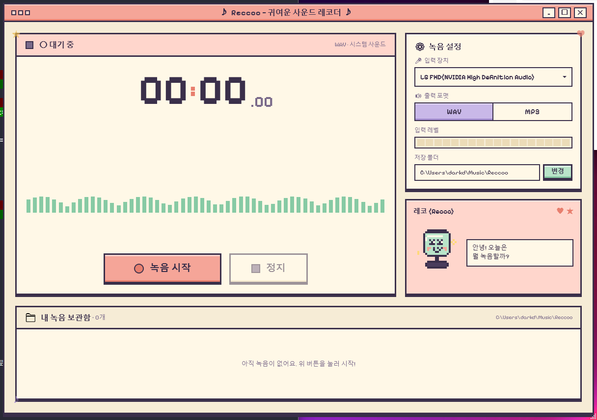

# Reccoo (레코)

> 🎀 **귀여운 픽셀 아트 사운드 레코더 for Windows**
> A cute pixel-art audio recorder built on .NET 9 + WPF




[](https://github.com/darkdarkcocoa/Reccoo/releases/latest)

---

## ⬇️ 다운로드 (그냥 받아서 바로 실행하기)

> **[📦 Reccoo.exe 받기 (Windows x64, ~76 MB)](https://github.com/darkdarkcocoa/Reccoo/releases/latest/download/Reccoo.exe)**
>
> .NET 런타임이 통째로 들어있는 single-file 실행파일이라 **별도 설치 없이 더블클릭만 하면 실행돼**. SmartScreen이 경고를 띄우면 "추가 정보" → "실행" 누르면 됨.

전체 릴리스 노트는 [Releases 페이지](https://github.com/darkdarkcocoa/Reccoo/releases)에서.

---

## ✨ 특징 / Features

- 🎨 **픽셀 아트 UI** — 크림/코랄/민트/라일락 파스텔 팔레트 + 두꺼운 ink 보더 + 4px 오프셋 그림자
- 🎤 **시스템 사운드 녹음** — `WasapiLoopbackCapture`로 PC 출력 음원을 그대로 캡처
- 💾 **WAV / MP3 토글** — NAudio.Lame으로 MP3 인코딩
- 〰️ **라이브 파형** — 56-bar 실시간 시각화 (높이별 mint → gold → coral 그라데이션)
- 📊 **입력 레벨 미터** — 18-cell 픽셀 미터
- 🐤 **마스코트 "레코(Recco)"** — 24×28 픽셀 sprite, idle/recording 모드별 표정
- 📁 **녹음 보관함** — 저장 폴더 자동 스캔, 카세트 카드 그리드, 인라인 ▶ / ✕
- 🪟 **커스텀 픽셀 윈도우** — 타이틀바, 드래그 무브, 더블클릭 maximize, 그립 리사이즈

---

## 🛠️ 직접 빌드하고 싶다면

**필수**: [.NET 9 SDK](https://dotnet.microsoft.com/download), Windows 10/11

```powershell
git clone https://github.com/darkdarkcocoa/Reccoo.git
cd Reccoo
dotnet run
```

또는 Release 빌드:

```powershell
dotnet build -c Release
./bin/Release/net9.0-windows/Reccoo.exe
```

녹음은 기본 출력 장치에서 캡처되고, 파일은 `Documents\Music\Reccoo\Reccoo_yyyyMMdd_HHmmss.{wav|mp3}` 패턴으로 저장돼.

---

## 📁 프로젝트 구조

```
Reccoo/
├── App.xaml                  # 픽셀 테마 ResourceDictionary (팔레트 + 컨트롤 스타일)
├── App.xaml.cs
├── MainWindow.xaml           # 1216×736 메인 레이아웃
├── MainWindow.xaml.cs        # 트랜스포트 / 파형 / 마스코트 / 보관함 로직
├── AudioRecorder.cs          # NAudio 캡처 + WAV/MP3 인코딩
├── AssemblyInfo.cs
├── Reccoo.csproj
├── Fonts/
│   ├── PixelifySans.ttf      # OFL 1.1
│   ├── DotGothic16-Regular.ttf  # OFL 1.1 (한글 픽셀)
│   └── *-OFL.txt             # 폰트 라이선스
└── design/                   # Claude Design 시안 (gitignored)
```

---

## 🎵 임베드 폰트

| 폰트 | 용도 | 라이선스 |
|------|------|----------|
| [Pixelify Sans](https://fonts.google.com/specimen/Pixelify+Sans) | 영문/숫자 픽셀 글꼴 | OFL 1.1 |
| [DotGothic16](https://fonts.google.com/specimen/DotGothic16) | 한글/CJK 픽셀 글꼴 | OFL 1.1 |

WPF 글리프 폴백 덕에 `Pixelify Sans → DotGothic16 → Consolas` 순으로 자동 매칭돼.

---

## 🎨 디자인 토큰

```
ink-dark   #3A2F4A      cream      #F6ECD6
ink        #4A3C5C      cream-deep #ECDCB8
ink-soft   #7A6A8A      paper      #FFF8E7
                        coral      #F5A598
mint       #B9E4C9      coral-deep #E87F6E
mint-deep  #87CAA4      lilac      #C9B8E8
gold       #FFD97A      lilac-deep #A48DD0
```

---

## 📜 License

[MIT](LICENSE) © darkcocoa

폰트는 각각 [SIL Open Font License 1.1](Fonts/PixelifySans-OFL.txt) 적용.

---

<sub>🤖 시안 디자인 + WPF 구현은 [Claude Code](https://claude.com/claude-code)와 함께</sub>
