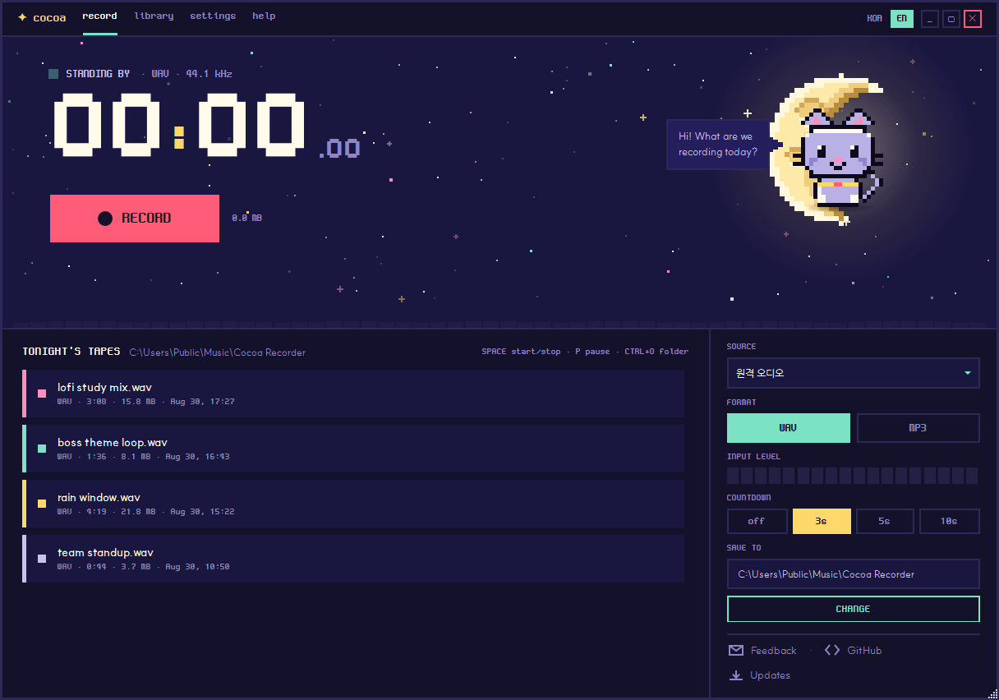

# Cocoa Recorder

> 🎀 **A cozy pixel-art system audio recorder for Windows**
> Built on .NET 9 + WPF

[한국어](README.ko.md) | **English**

Cocoa Recorder (formerly Reccoo) is a small recorder that captures whatever your PC is playing. Streaming music, game audio, live broadcasts — anything coming out of your speakers can be recorded with a single click and saved as WAV or MP3. Since it records the audio signal directly (not through a microphone), recordings are clean with no background noise. And while you record, the pixel mascot "Coco" keeps you company. 🐤




[](https://github.com/darkdarkcocoa/cocoa-recorder/releases/latest)

---

## 🌏 Language Support

| | 한국어 (Korean) | English |
|---|:---:|:---:|
| **App UI** | ✅ | ✅ |
| **Mascot dialogue** | ✅ | ✅ |
| **README** | ✅ | ✅ |

Switch anytime with the **KOR | EN toggle** in the title bar. The app follows your system language on first launch.
Interested in adding another language? See [CONTRIBUTING.md](CONTRIBUTING.md).

---

## ⬇️ Download

Download, double-click, done. No installer, no separate .NET runtime required.

> **[📦 Get the latest Windows release](https://github.com/darkdarkcocoa/cocoa-recorder/releases/latest)** — download `CocoaRecorder.exe` (`Reccoo.exe` on releases before the rename)
> ([](https://github.com/darkdarkcocoa/cocoa-recorder/releases/latest) [](https://github.com/darkdarkcocoa/cocoa-recorder/releases/latest))
>
> It is a self-contained single-file executable with the .NET runtime bundled in. On first launch, SmartScreen may warn about an "unrecognized app" — this is because the binary is not code-signed yet. Click **"More info" → "Run anyway"** to start it.

Full changelogs are on the [Releases page](https://github.com/darkdarkcocoa/cocoa-recorder/releases).

---

## ✨ Features

**🎙️ Recording**

- **System audio capture** — records whatever comes out of your speakers, losslessly (WASAPI loopback)
- **Adjustable countdown** — set 0–10 seconds of lead-in before recording starts. Leave it at 0 to record the moment you press the button, or stretch it to give yourself time to switch windows
- **Pause / resume** — skip ads or unwanted sections and pick up where you left off
- **WAV / MP3 toggle** — keep the original as WAV, or save space with MP3 (LO / MED / HI quality)

**👀 Fun to watch**

- **Live waveform** — the current audio dances across 56 pixel bars (mint → gold → coral gradient)
- **Input level meter** — an 18-cell pixel meter shows the volume at a glance
- **Mascot "Cocoa"** — bobs along with the audio, changes expressions with the recording state, and occasionally chats
- **KOR | EN language toggle** — flip the whole UI (mascot chatter included) between Korean and English right from the title bar

**📼 After recording**

- **Library** — recordings are organized as cassette-tape cards, with duration display and inline renaming
- **Mini player** — play recordings right inside the app and seek with a progress bar
- **Drag to export** — drag a card into a folder or a chat window to copy the file
- **Recycle-bin deletes** — deleted files go to the Recycle Bin, so mistakes are recoverable
- **Keyboard shortcuts** — start and stop recording without touching the mouse

---

## 💡 What can you record?

Cocoa Recorder captures **any sound your PC plays**, so it's a handy free tool for things like:

- 🎧 **Recording streaming music** — Spotify, YouTube Music, Apple Music, SoundCloud, Bandcamp
- 📺 **Saving audio from videos** — YouTube, Twitch, Netflix and other in-browser playback
- 🎙️ **Capturing online meetings & calls** — Discord, Zoom, Microsoft Teams, Google Meet
- 🎮 **Grabbing game audio and voice lines**
- 📻 **Archiving live radio, podcasts, and broadcasts**
- 🎓 **Keeping lectures, webinars, and language-learning audio**

Because it records the audio signal directly through **WASAPI loopback** (no microphone), every capture is clean and free of background noise.

> ⚠️ Please respect copyright and each service's terms of use — record only content you have the right to save.

---

## 🛠️ Building from source

All you need is the [.NET 9 SDK](https://dotnet.microsoft.com/download) and Windows 10/11.

```powershell
git clone https://github.com/darkdarkcocoa/cocoa-recorder.git
cd cocoa-recorder
dotnet run
```

Or a release build:

```powershell
dotnet build -c Release
./bin/Release/net9.0-windows/CocoaRecorder.exe
```

Audio is captured from the default output device. New installs save files to `Music\Cocoa Recorder\` as `CocoaRecorder_yyyyMMdd_HHmmss.{wav|mp3}`; existing `Music\Reccoo\` libraries continue to open in place.

---

## 📁 Project structure

The structure is intentionally simple — just a handful of source files, no frameworks.

```
cocoa-recorder/
├── App.xaml                  # Pixel theme ResourceDictionary (palette + control styles)
├── App.xaml.cs
├── MainWindow.xaml           # 1216×736 main layout
├── MainWindow.xaml.cs        # Transport / waveform / library logic
├── Mascot.cs                 # Cocoa sprite — drawn pixel by pixel, not an image asset
├── AudioRecorder.cs          # NAudio capture + WAV/MP3 encoding
├── AssemblyInfo.cs
├── CocoaRecorder.csproj
├── Fonts/
│   ├── PixelifySans.ttf      # OFL 1.1
│   ├── neodgm.ttf            # OFL 1.1 (display font)
│   ├── SUIT-*.ttf            # OFL 1.1 (readable UI font)
│   └── *-OFL.txt             # Font licenses
└── design/                   # Claude Design mockups (gitignored)
```

---

## 🎵 Embedded fonts

| Font | Role | License |
|------|------|---------|
| [Pixelify Sans](https://fonts.google.com/specimen/Pixelify+Sans) | Large timer numerals | OFL 1.1 |
| [NeoDunggeunmo](https://github.com/neodgm/neodgm) | Pixel display text and primary controls | OFL 1.1 |
| [SUIT](https://github.com/sun-typeface/SUIT) | Labels, paths, device names, and library metadata | OFL 1.1 |

The split type system keeps the pixel personality in prominent controls while making dense Korean and English UI copy easier to read.

---

## 🎨 Design tokens

Cocoa's palette. When touching the UI, please pick from these colors instead of inventing new ones.

```
ink-dark   #3A2F4A      cream      #F6ECD6
ink        #4A3C5C      cream-deep #ECDCB8
ink-soft   #7A6A8A      paper      #FFF8E7
                        coral      #F5A598
mint       #B9E4C9      coral-deep #E87F6E
mint-deep  #87CAA4      lilac      #C9B8E8
gold       #FFD97A      lilac-deep #A48DD0
```

---

## 🤝 Contributing

Contributions are always welcome! Feel free to open an issue or submit a pull request for bug fixes, improvements, or new ideas. For substantial changes, please open an issue first so we can discuss the direction together. See [CONTRIBUTING.md](CONTRIBUTING.md) for the project conventions.

---

## 📜 License

[MIT](LICENSE) © darkcocoa — use it freely, just keep the copyright notice.

Fonts are licensed under the [SIL Open Font License 1.1](Fonts/PixelifySans-OFL.txt).

---

<sub>🤖 Designed and built with [Claude Code](https://claude.com/claude-code)</sub>
